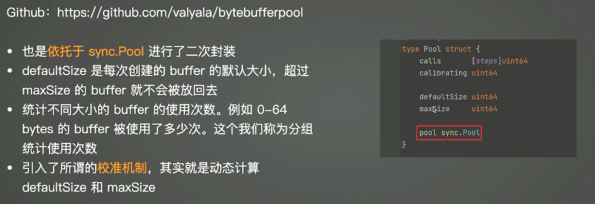
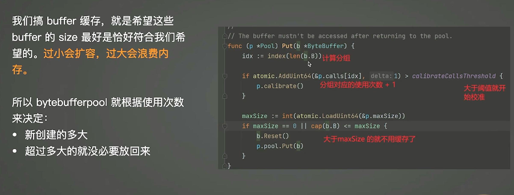
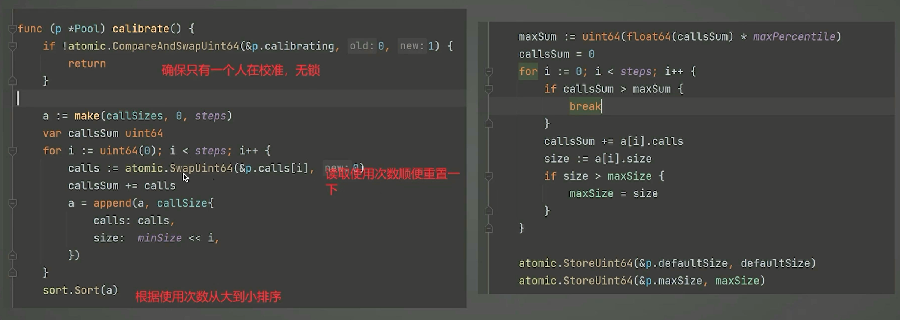

常用数据结构（红黑树,b树等）：
```bash
go get github.com/emirpasic/gods
```

opentelemetry (可观测性)
```bash
go get go.opentelemetry.io/otel
```

## web 
### gin
```bash
# gin
go get github.com/gin-gonic/gin
# gin-session
go get github.com/gin-contrib/sessions
```

优质 session 结构体定义
```bash
go get github.com/gorilla/sessions
```

## 数据库
### sqlmock
```bash
go get github.com/DATA-DOG/go-sqlmock
```

## 测试相关
testify (assert/) 
```bash
go get github.com/stretchr/testify/assert
assert.Equal(t, expected, actual)  # 函数方法无法比较，只能使用反射获取值后比较

go get github.com/stretchr/testify/require
require.NoError(t, err)
```

mockgen
```bash
go get github.com/golang/mock/gomock
go get github.com/golang/mock/mockgen
go get github.com/golang/mock/mockgen/model
go install github.com/golang/mock/mockgen@v1.6.0
mockgen -destination=cache/mocks/mock_redis_cmdable.gen.go -package=mocks github.com/go-redis/redis/v9 Cmdable
mockgen -source=db.go -destination=db_mock.go -package=main
```

## 缓存
go-redis redis客户端
```bash
go get github.com/redis/go-redis/v9
```

singleflight
```bash
go get golang.org/x/sync/singleflight
```

优质缓存 go-cache
```bash
go get github.com/patrickmn/go-cache
```

lru
```bash
go get github.com/hashicorp/golang-lru
```

bytebufferpoll
```bash
go get github.com/valyala/bytebufferpool 
```




### 分布式存储组件
etcd
``bash
go get go.etcd.io/etcd/client/v3
```

### 原子操作
uber atomic
```bash
go get go.uber.org/atomic
```

可观测性
(metrics) promethus:
```bash
go get github.com/prometheus/client_golang/prometheus
go get go.buf.build/protocolbuffers/go/prometheus/prometheus
```
(tracing) opentelemetry:
```bash
go get go.opentelemetry.io/otel
```