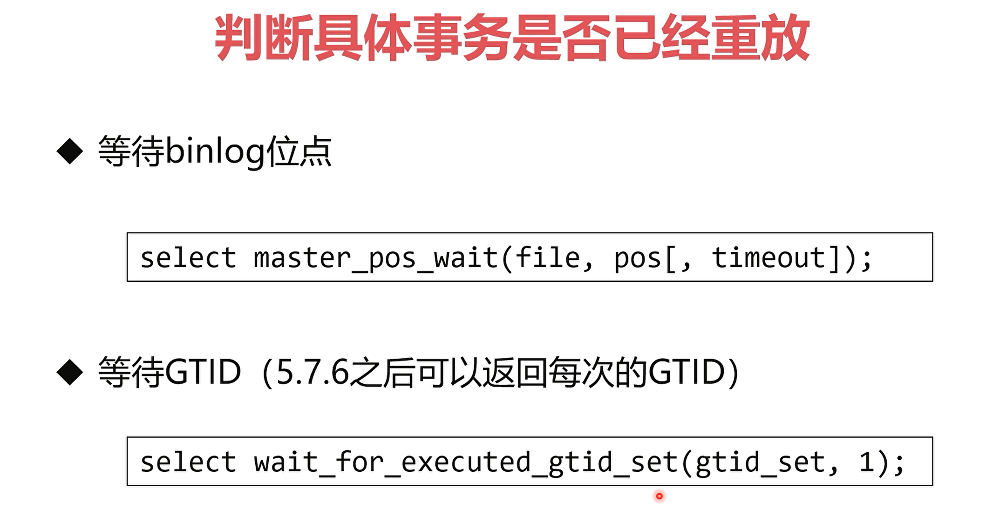

centos 下 mysql 安装:
```bash
wget https://cdn.mysql.com//Downloads/MySQL-5.7/mysql-5.7.43-1.el7.x86_64.rpm-bundle.tar

# 1. rpm: common
rpm -ivh mysql-community-common-5.7.43-1.el7.x86_64.rpm 

# 2. rpm: libs
rpm -ivh mysql-community-libs-5.7.43-1.el7.x86_64.rpm 

# 2.1. mariadb-libs 依赖报错
rpm -qa | grep mariadb
rpm -e --nodeps mariadb-libs-5.5.68-1.el7.x86_64

# 2.2. 签名校验错误
rpm -ivh --force --nodeps mysql-community-libs-5.7.43-1.el7.x86_64.rpm 

# 3. rpm:client
 rpm -ivh mysql-community-client-5.7.43-1.el7.x86_64.rpm 

# 4. rpm: server
rpm -ivh --force --nodeps mysql-community-server-5.7.43-1.el7.x86_64.rpm 
```

mysql 取消检查:


## 索引组织表

- 每个表独占表空间


新增前缀索引：
```sql
alter table user add index index_name(email(6))
```

(like %关键字%) (like %关键字) 会 使 索引 失效
(like 关键字%) 才能利用索引


查看建表语句:
```sql
show create table table_name;
```

查看执行计划:
```sql
explain 语句
```

慢查询怀疑方向:
- 


## mysql备份:
1. outfile 命令 (在可重复读的事务下能够做到一致性备份)
```sql
-- 查看 mysql 导出地址
show variables like '%secure%';

-- 使用into outfile 指令将查询结果导出为文件
select * into outfile 'file_name' (fields/lines terminates by ',') form table_name;  --fields/lines  分割符/换行符
```

2. mysqldump 进行备份 (逻辑备份)
```bash
mysqldump -uroot -p123456 --databases name --single-transation > 1.sql
```
> mysqldump 增量备份思路: mysqldump 全量备份后, 根据binlog进行增量备份
```bash
mysqldump -uroot -p123456 --databases name --single-transation --flush-logs --master-data=2 > 1.sql
# --flush-logs: 备份后切换的binlog文件
# --master-data=2: 记录切换后的binlog文件名

# 需要增量备份时, 切换binlog文件:
mysqladmin -uroot -p123456 flush-logs;  # 在将新增的binlog文件备份

# 还原 1. 先还原全量备份内容
source 1.sql
# 2.然后将增量binlog文件还原至数据库
mysqlbinlog mysql-bin.000001 mysql-bin.000001 | mysql -uroot -p123456
```

3. xtrabackup


> 安装及使用
> 
> 
> 

### 主从复制


1. 主备复制只是复制增量, 需先全量复制
```sql
-- (主)上全局锁
FLUSH TABLES WITH READ LOCK;

-- 显示 binlog 当前写入状态
SHOW MASTER STATUS \G;
```
```bash
-- 使用 mysqldump
mysqldump -u root -p123456 --all-database --master-data > 1.sql

# 将 sql 发送给从节点(scp/rz...)
scp 1.sql root@192.168.1.1:/root/where
```

接触主节点的锁
```sql
unlock tables
```

-> 切换为从库: 执行发送过来的 1.sql 
```sql
-- 查看主从状态
show slave status \G;

-- 如果已经配置了同步
shop slave;
reset slave;

change master to
MASTER_HOST='192.112.12.3', -- 主节点
MASTER_USER='root',  -- 主节点的一个用户
MASTER_LOG_FILE='mysql-bin.000003', -- 那个 bin 文件, 主节点的slave status 中查看
MASTER_LOG_POS=123;-- bin 文件中的位置
```

主从半同步配置

查看半同步脱扣时间
```sql
-- 超过时间转换为异步状态
show variables like 'rpl_semi_sync_master_timeout';

-- 查看当前线程
show precesslist \G;
```

> 配置优化思路(基于事务唯一ID):
> 
> 
> 
> stop slave;
> 
> start slave;
> 

### binlog 格式
(5.0 之前) 记录statement(会导致主从执行顺序不同, 主从索引可能不同)
```sql
-- 显示 binlog 格式
show variable like 'binlog_format';

-- 改变变量
set binlog_format=statement;

-- 显示警告
show warnings;

show master status \G;

show binlog envents in 'mysql-bin.000003' \G;
```

row 格式

mix 格式


备库延后


解决思路:


优化


采用读写分离机制, 从从库上读需要判断相应事务是否已放在从库, 阻塞查询(解决从库延时问题)



#### 主主复制架构, 及配置:


```sql
-- 两个节点相同配置
stop slave;

change master to
MASTER_HOST='192.112.12.3', -- 主节点
MASTER_USER='root',  -- 主节点的一个用户
MASTER_POSSWORD='123456',
master_auto_position=1; -- 配置有开启 GTID

start slave;
show slave status;
```


### 分区表


### 分库分表


分库


分库分表中间件


