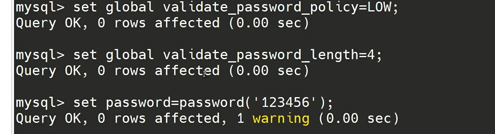

开启远程登陆：
blog: https://blog.csdn.net/yiminghd2861/article/details/115464091
```sql
-- grant all privileges on *.* to 'root'@'%' indentified by '123' with grant option;
create user root@'%' identified by '123456';
 
grant all privileges on *.* to root@'%' with grant option;

2: 
use mysql 　　　　 #选择访问mysql库
update user set host = '%' where user = 'root'; 　　　　 #使root能再任何host访问
FLUSH PRIVILEGES; 　　 　　 #刷新 

ALTER USER "root"@"%" IDENTIFIED  BY "1234";

FLUSH PRIVILEGES; 　　 　　 #刷新 
```

创建用户, 并分配权限:
```sql
grant all on 数据库名.数据库表 to 用户名@'%'  identified by "密码";
```
> all 可以替换为 select,delete,update,create,drop
>
> 数据库名 所有的 用*
>
>数据库表 所有的 用*

更新权限:
```sql
FLUSH PRIVILEGES;
```

启动弱密码:

```sql
set global validate_password_policy=LOW;
set global validate_password_length=9;
```

修改密码：
```sql
update mysql.user set authentication_string=password('root') where user = 'root';
```

记录执行了那些 sql:
```sql
SET GLOBAL log_output = 'TABLE';
SET GLOBAL general_log = 'ON';
```

