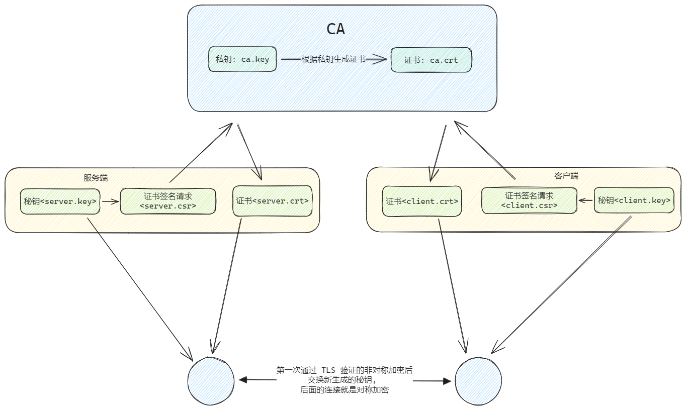

> https://access.redhat.com/documentation/zh-cn/red_hat_enterprise_linux/9/html/securing_networks/creating-a-private-ca-using-openssl_creating-and-managing-tls-keys-and-certificates
>
> https://access.redhat.com/documentation/zh-cn/red_hat_enterprise_linux/9/html-single/securing_networks/index

